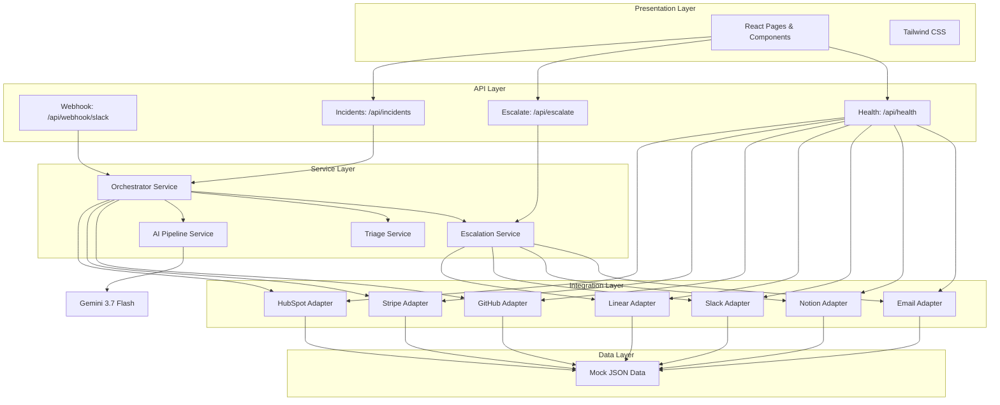
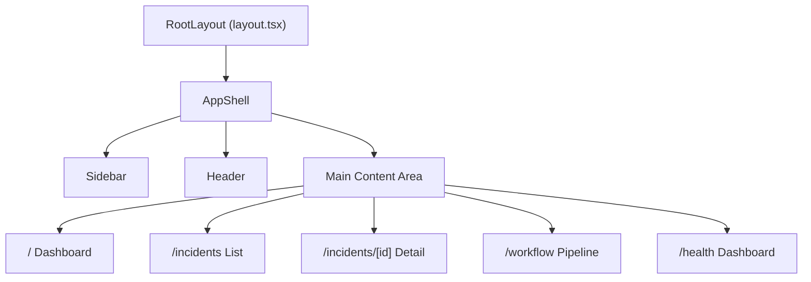
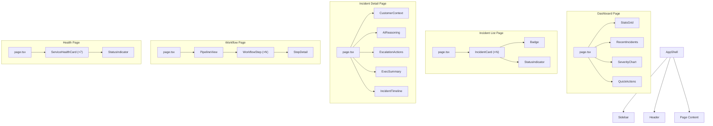
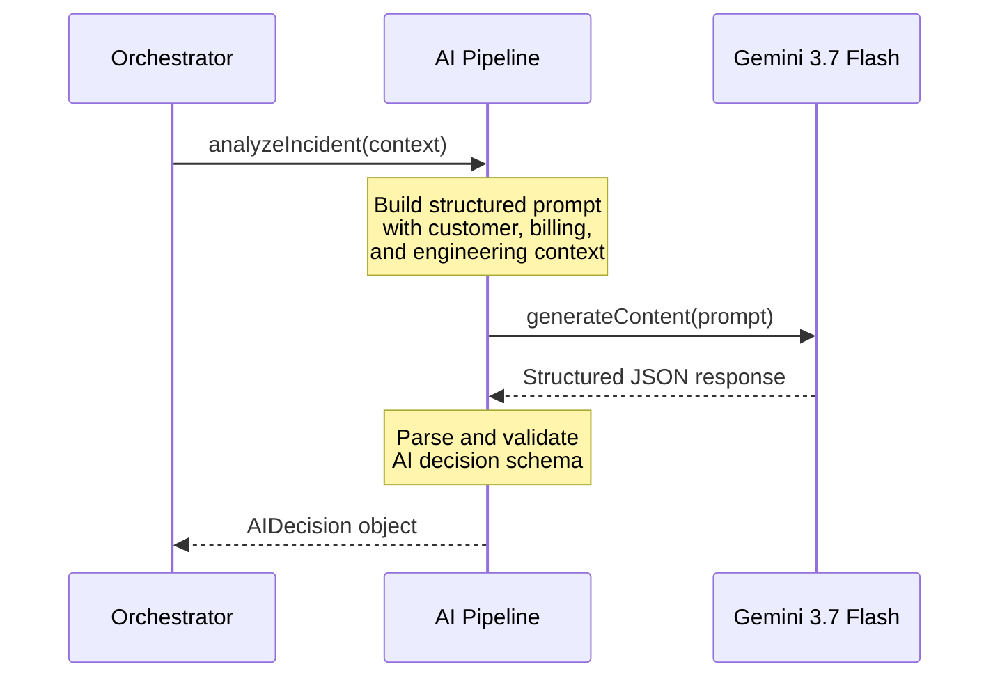
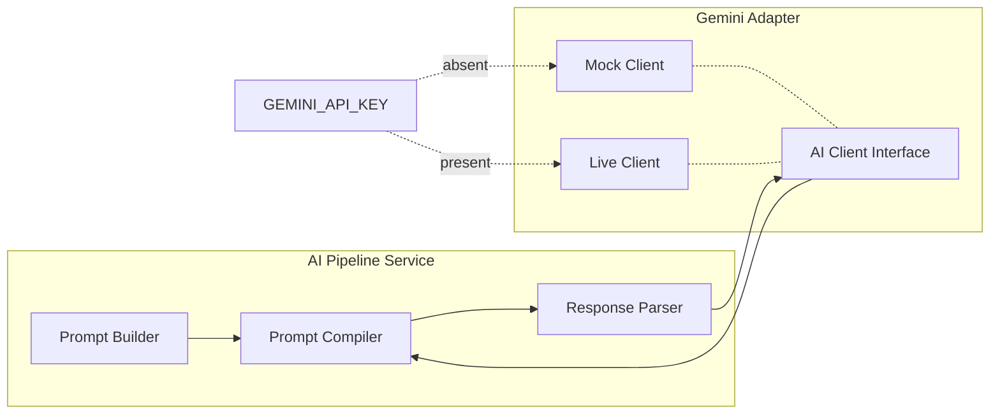
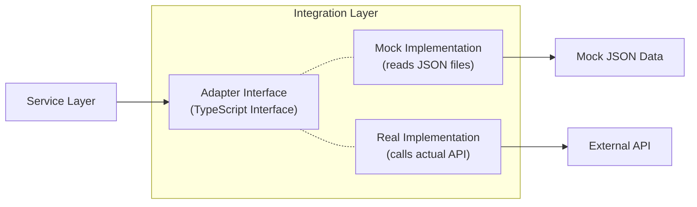
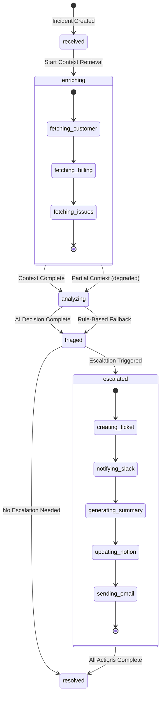
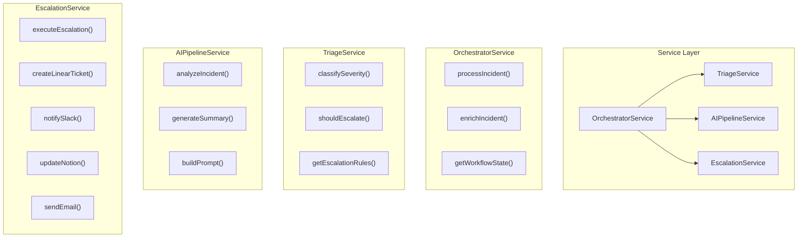
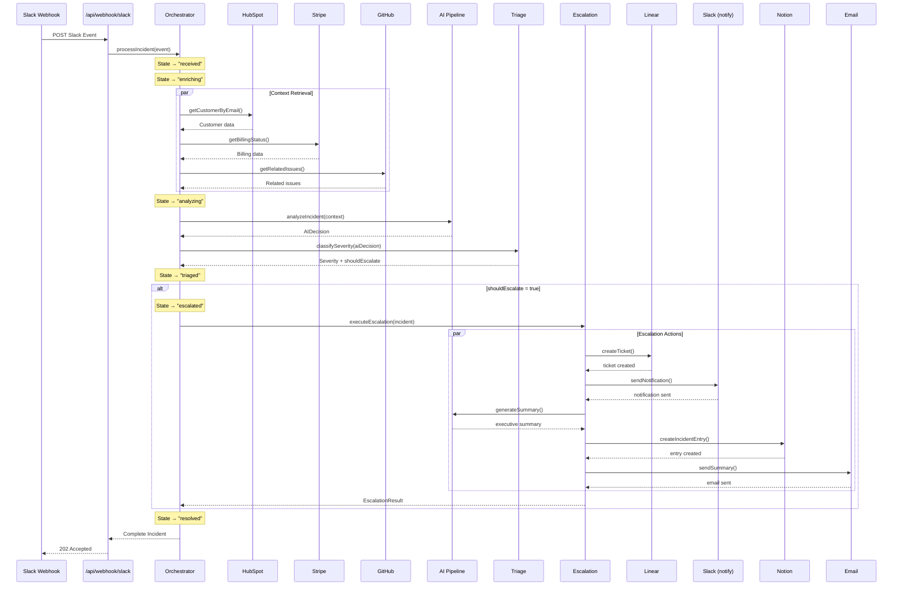

# ARCHITECTURE.md

## Customer Escalation Autopilot — System Architecture

---

## 1. High-Level System Architecture

The system is a **monolithic Next.js application** using the App Router, structured into clean layers with dependency injection boundaries. All external service integrations use an **adapter pattern** so mocks can be swapped for real APIs.



---

## 2. Folder Structure

```
src/
├── app/                           # Next.js App Router
│   ├── layout.tsx                 # Root layout with sidebar navigation
│   ├── page.tsx                   # Dashboard (default route)
│   ├── globals.css                # Global styles + Tailwind directives
│   │
│   ├── incidents/
│   │   ├── page.tsx               # Incident list view
│   │   └── [id]/
│   │       └── page.tsx           # Single incident detail view
│   │
│   ├── workflow/
│   │   └── page.tsx               # Live workflow pipeline visualization
│   │
│   ├── health/
│   │   └── page.tsx               # Service health monitoring dashboard
│   │
│   └── api/                       # API Routes (server-side)
│       ├── incidents/
│       │   ├── route.ts           # GET: list incidents, POST: create incident
│       │   └── [id]/
│       │       └── route.ts       # GET: single incident by ID
│       ├── escalate/
│       │   └── route.ts           # POST: trigger full escalation pipeline
│       ├── health/
│       │   └── route.ts           # GET: all service health statuses
│       └── webhook/
│           └── slack/
│               └── route.ts       # POST: ingest Slack event
│
├── components/
│   ├── ui/                        # Generic, reusable UI primitives
│   │   ├── badge.tsx              # Severity/status badges
│   │   ├── card.tsx               # Content card container
│   │   ├── button.tsx             # Action buttons
│   │   ├── skeleton.tsx           # Loading skeleton placeholders
│   │   ├── status-indicator.tsx   # Health status dot/pill
│   │   └── progress-bar.tsx       # Step progress indicator
│   │
│   ├── layout/                    # Application shell
│   │   ├── app-shell.tsx          # Main layout wrapper
│   │   ├── sidebar.tsx            # Navigation sidebar
│   │   └── header.tsx             # Page header with breadcrumbs
│   │
│   ├── dashboard/                 # Dashboard-specific widgets
│   │   ├── stats-grid.tsx         # Summary metric cards
│   │   ├── recent-incidents.tsx   # Latest incidents table
│   │   ├── severity-chart.tsx     # Severity distribution
│   │   └── quick-actions.tsx      # Shortcut buttons
│   │
│   ├── incidents/                 # Incident-related components
│   │   ├── incident-card.tsx      # Incident summary card
│   │   ├── incident-detail.tsx    # Full incident view
│   │   ├── incident-timeline.tsx  # Chronological event timeline
│   │   ├── customer-context.tsx   # Customer 360 panel
│   │   ├── ai-reasoning.tsx       # AI decision explanation
│   │   ├── escalation-actions.tsx # Escalation action results
│   │   └── exec-summary.tsx       # Executive summary card
│   │
│   └── workflow/                  # Workflow visualization
│       ├── pipeline-view.tsx      # Full pipeline visualization
│       ├── workflow-step.tsx      # Individual step with status
│       └── step-detail.tsx        # Expanded step detail panel
│
├── lib/
│   ├── services/                  # Business logic layer
│   │   ├── orchestrator.ts        # Main workflow engine
│   │   ├── triage.ts              # Severity classification logic
│   │   ├── ai-pipeline.ts         # Gemini prompt + response handling
│   │   └── escalation.ts          # Escalation action dispatcher
│   │
│   ├── integrations/              # External service adapters
│   │   ├── types.ts               # Adapter interface definitions
│   │   ├── hubspot.ts             # Customer data adapter
│   │   ├── stripe.ts              # Billing data adapter
│   │   ├── github.ts              # Issue data adapter
│   │   ├── linear.ts              # Ticket creation adapter
│   │   ├── slack.ts               # Notification adapter
│   │   ├── notion.ts              # Incident log adapter
│   │   └── email.ts               # Email notification adapter
│   │
│   ├── mock-data/                 # Static mock data
│   │   ├── customers.json         # HubSpot customer records
│   │   ├── incidents.json         # Pre-seeded incidents
│   │   ├── stripe-accounts.json   # Stripe billing data
│   │   ├── github-issues.json     # GitHub issue data
│   │   └── ai-responses.json      # Pre-computed AI responses
│   │
│   ├── types/                     # TypeScript type definitions
│   │   └── index.ts               # All shared types/interfaces
│   │
│   └── utils/                     # Utility functions
│       ├── health-monitor.ts      # Service health check logic
│       ├── formatters.ts          # Date, currency, text formatting
│       └── constants.ts           # App-wide constants
│
└── styles/
    └── globals.css                # Tailwind base + custom CSS
```

---

## 3. Next.js App Router Structure

### Route Map

| Route | Type | Purpose |
|---|---|---|
| `/` | Page | Dashboard — summary stats, recent incidents, quick actions |
| `/incidents` | Page | Filterable list of all incidents |
| `/incidents/[id]` | Page | Incident detail — full context, AI reasoning, escalation results |
| `/workflow` | Page | Live workflow pipeline visualization |
| `/health` | Page | Service health dashboard |
| `/api/incidents` | API | `GET` list / `POST` create incident |
| `/api/incidents/[id]` | API | `GET` single incident |
| `/api/escalate` | API | `POST` trigger escalation pipeline |
| `/api/health` | API | `GET` service health check |
| `/api/webhook/slack` | API | `POST` Slack event webhook |

### Layout Hierarchy



---

## 4. Component Hierarchy



---

## 5. API Route Design

### `POST /api/webhook/slack`

**Purpose:** Ingest a Slack incident event. This is the primary entry point for the pipeline.

**Request body:** SlackEvent payload (see DATA_MODEL.md)

**Response:** `202 Accepted` with `{ incidentId, status: "processing" }`

**Internal flow:**
1. Validate and parse the Slack event
2. Extract customer identifier and incident description
3. Call `orchestrator.processIncident()`
4. Return immediately with the incident ID

---

### `GET /api/incidents`

**Purpose:** List all incidents, optionally filtered by severity or status.

**Query params:** `?severity=critical&status=escalated&limit=20`

**Response:** `200 OK` with `{ incidents: Incident[], total: number }`

---

### `POST /api/incidents`

**Purpose:** Create a new incident manually (for demo purposes / form submission).

**Request body:** `{ customerEmail, description, source }` (minimal fields)

**Response:** `201 Created` with the full Incident object

**Internal flow:**
1. Create incident record
2. Call `orchestrator.processIncident()`
3. Return incident with all enriched data

---

### `GET /api/incidents/[id]`

**Purpose:** Retrieve a single incident with full context.

**Response:** `200 OK` with full Incident object (including customer context, AI decision, escalation results, timeline)

---

### `POST /api/escalate`

**Purpose:** Trigger the full escalation pipeline for an incident.

**Request body:** `{ incidentId }`

**Response:** `200 OK` with `EscalationResult`

**Internal flow:**
1. Load incident by ID
2. Run orchestrator pipeline
3. Return escalation results

---

### `GET /api/health`

**Purpose:** Check health status of all integrated services.

**Response:** `200 OK` with `{ services: HealthCheckResponse[] }`

**SkillPatch:** Uses `api-health-monitoring` patterns.

---

## 6. AI Decision Pipeline

The AI pipeline is the core intelligence layer. It uses **Gemini 3.7 Flash** to reason over aggregated incident context and produce a structured escalation decision.



### Prompt Architecture

The AI prompt follows a structured template:

```
SYSTEM: You are an enterprise incident triage analyst. Analyze the following
        incident and provide a structured severity assessment.

CONTEXT:
- Customer: {customer data from HubSpot}
- Billing: {billing data from Stripe}
- Related Issues: {open issues from GitHub}
- Incident: {original Slack message and metadata}

INSTRUCTIONS:
1. Assess business impact based on customer tier and contract value
2. Evaluate technical severity based on the incident description
3. Check for existing related issues that may indicate a pattern
4. Determine if this requires immediate escalation

RESPOND IN JSON:
{
  "severity": "low | medium | high | critical",
  "confidence": 0.0-1.0,
  "reasoning": "...",
  "businessImpact": "...",
  "technicalAssessment": "...",
  "recommendedActions": ["..."],
  "shouldEscalate": true/false,
  "escalationReason": "...",
  "executiveSummary": "..."
}
```

### Mock AI Strategy

For the hackathon MVP (no API key required), the AI pipeline has two modes:

1. **Mock Mode (default):** Returns pre-computed AI responses from `ai-responses.json` matched by incident keywords
2. **Live Mode:** When `GEMINI_API_KEY` is set in `.env.local`, calls the actual Gemini API

**SkillPatch:** Uses `api-ai-augmented` for structured AI reasoning and function calling patterns.

---

## 7. Gemini Integration Architecture



### Key Design Decisions

| Decision | Rationale |
|---|---|
| **Structured JSON output** | Gemini returns a typed `AIDecision` object, not free text |
| **Confidence score** | Enables threshold-based escalation rules |
| **Transparent reasoning** | AI reasoning is displayed in the UI for auditability |
| **Mock fallback** | Demo works without any API key |
| **Adapter interface** | Can swap Gemini for Claude, GPT, etc. without changing pipeline |

---

## 8. SkillPatch Integration Points

### `api-integration` — Workflow Orchestration

| Integration Point | Location | Usage |
|---|---|---|
| Event-driven architecture | `/api/webhook/slack/route.ts` | Slack event ingestion triggers the pipeline |
| API chaining | `lib/services/orchestrator.ts` | Sequential calls: HubSpot → Stripe → GitHub → AI → Escalation |
| Webhook orchestration | `/api/webhook/slack/route.ts` | Validates, parses, and dispatches Slack webhooks |
| Workflow orchestration | `lib/services/orchestrator.ts` | State machine managing the full incident lifecycle |

### `api-ai-augmented` — AI Decision Making

| Integration Point | Location | Usage |
|---|---|---|
| AI-assisted decisions | `lib/services/ai-pipeline.ts` | Gemini reasons over aggregated context |
| Structured reasoning | `lib/services/ai-pipeline.ts` | JSON-schema-constrained AI output |
| Function calling | `lib/services/ai-pipeline.ts` | Tool-call pattern for severity classification |
| API orchestration with LLM | `lib/services/orchestrator.ts` | AI decides which escalation actions to take |

### `api-health-monitoring` — Service Health

| Integration Point | Location | Usage |
|---|---|---|
| Health checks | `lib/utils/health-monitor.ts` | Pings each integration adapter for availability |
| Service availability | `/api/health/route.ts` | Aggregates all service statuses |
| Fallback decisions | `lib/services/orchestrator.ts` | Graceful degradation when a service is down |
| Status monitoring | `/health` page | Dashboard showing all service statuses |

### `triage` — Severity Classification

| Integration Point | Location | Usage |
|---|---|---|
| Severity classification | `lib/services/triage.ts` | Maps signals to Low / Medium / High / Critical |
| Escalation routing | `lib/services/escalation.ts` | Routes based on severity + customer tier |
| Incident state machine | `lib/services/orchestrator.ts` | States: received → enriching → analyzing → triaged → escalated → resolved |
| Enterprise priority | `lib/services/triage.ts` | Enterprise customers automatically escalated at Medium+ |

---

## 9. Mock API Architecture

Every external integration follows the **Adapter Pattern**:



### Adapter Interface Example (conceptual)

Each integration adapter exports the same interface:

```
Interface: HubSpotAdapter
  - getCustomerByEmail(email: string): Promise<Customer>
  - getCustomerById(id: string): Promise<Customer>

Interface: StripeAdapter
  - getBillingStatus(customerId: string): Promise<StripeBilling>

Interface: GitHubAdapter
  - getRelatedIssues(query: string): Promise<GitHubIssue[]>

Interface: LinearAdapter
  - createTicket(ticket: LinearTicketInput): Promise<LinearTicket>

Interface: SlackAdapter
  - sendNotification(channel: string, message: SlackMessage): Promise<void>

Interface: NotionAdapter
  - createIncidentEntry(entry: NotionEntry): Promise<NotionEntry>

Interface: EmailAdapter
  - sendSummary(to: string[], summary: ExecutiveSummary): Promise<void>
```

### Mock Data Files

| File | Contains | Records |
|---|---|---|
| `customers.json` | HubSpot customer records | 5 customers (mix of Enterprise/Startup/SMB) |
| `stripe-accounts.json` | Stripe billing data | 5 accounts (active, past_due, trialing) |
| `github-issues.json` | GitHub issue data | 10 issues (open, closed, various labels) |
| `incidents.json` | Pre-seeded incidents | 5 incidents at various stages |
| `ai-responses.json` | Pre-computed AI analysis | 5 responses (one per severity level + edge case) |

### Mock → Real Migration Strategy

1. Create a `real/` subdirectory inside `lib/integrations/`
2. Implement each adapter using the real API client
3. Add a factory function that selects mock vs. real based on environment:
   ```
   getHubSpotAdapter() → checks env → returns MockHubSpot or RealHubSpot
   ```
4. No service layer code changes needed

---

## 10. Error Handling Strategy

### API Route Error Handling

Every API route follows a consistent error response format:

```
{
  "error": {
    "code": "CUSTOMER_NOT_FOUND",
    "message": "No customer found for email: unknown@example.com",
    "details": { ... }
  }
}
```

### Error Categories

| Category | HTTP Status | Handling |
|---|---|---|
| Validation errors | `400` | Return specific field-level errors |
| Not found | `404` | Return helpful message with searched identifier |
| Integration failure | `502` | Log error, return fallback response, mark service degraded |
| AI pipeline failure | `500` | Fall back to rule-based triage, log AI error |
| Unexpected error | `500` | Generic error response, log stack trace |

### Graceful Degradation

When a service is unavailable, the pipeline continues with reduced context:

| Failed Service | Fallback Behavior |
|---|---|
| HubSpot | Use incident metadata only; treat as "Unknown" tier |
| Stripe | Skip billing context; note "billing unavailable" in AI prompt |
| GitHub | Skip related issues; note "issue history unavailable" |
| Gemini AI | Fall back to rule-based severity classification |
| Linear | Log ticket creation failure; mark escalation partial |
| Slack | Log notification failure; continue with other channels |
| Notion | Log entry failure; escalation still considered successful |
| Email | Log email failure; escalation still considered successful |

**SkillPatch:** Uses `api-health-monitoring` for fallback decision patterns.

---

## 11. State Management

### Client-Side State

The frontend uses **React Server Components** for data fetching with minimal client-side state:

| State Type | Approach |
|---|---|
| **Server data** | React Server Components fetch data directly in page components |
| **UI state** | `useState` for local component state (modals, filters, active tabs) |
| **Form state** | `useState` for controlled form inputs |
| **Polling** | `useEffect` + `setInterval` for workflow step progress updates |
| **Optimistic updates** | `useState` with immediate UI update, then server confirmation |

### Incident Lifecycle State Machine



**SkillPatch:** Uses `triage` for incident state machine patterns.

---

## 12. Loading & Error UX

### Loading States

| Component | Loading Behavior |
|---|---|
| Dashboard stats | Skeleton cards with shimmer animation |
| Incident list | Skeleton rows (5 placeholder cards) |
| Incident detail | Section-by-section skeleton loading |
| Workflow pipeline | Steps show as "pending" with pulse animation |
| Health dashboard | Service cards show "checking…" state |
| AI reasoning | Typing animation with "Analyzing…" text |

### Error States

| Component | Error Behavior |
|---|---|
| API failure | Inline error banner with retry button |
| Partial data | Show available data with "unavailable" badges for missing sections |
| Empty state | Helpful illustration + message + CTA to create first incident |
| Health check failure | Red status indicator with last successful check time |

---

## 13. Service Layer Architecture

The service layer is the core business logic. It is consumed by API routes and has no knowledge of HTTP or React.



### Service Responsibilities

| Service | Responsibility |
|---|---|
| **OrchestratorService** | Coordinates the full pipeline. Calls integrations, AI, triage, and escalation in sequence. Manages workflow state. |
| **TriageService** | Evaluates severity using AI output + business rules. Determines if escalation is needed based on severity + customer tier. |
| **AIPipelineService** | Builds prompts, calls Gemini (or mock), parses structured AI responses. Generates executive summaries. |
| **EscalationService** | Executes escalation actions: Linear ticket, Slack notification, Notion update, email. Reports partial success if some actions fail. |

---

## 14. Utility Layer

| Utility | Location | Responsibility |
|---|---|---|
| `health-monitor.ts` | `lib/utils/` | Pings each adapter, aggregates health statuses, caches results (30s TTL) |
| `formatters.ts` | `lib/utils/` | Date formatting, currency formatting, severity label formatting, text truncation |
| `constants.ts` | `lib/utils/` | Severity levels, status values, integration names, color mappings |

---

## 15. API Orchestration Flow

Full end-to-end flow when a Slack incident message arrives:



**SkillPatch:** Uses `api-integration` for API chaining and workflow orchestration patterns.

---

## 16. Future Production Migration Strategy

### Phase 1: Real API Integrations
- Implement real adapters in `lib/integrations/real/`
- Add environment-variable-based adapter selection
- One integration at a time: Slack → HubSpot → Stripe → GitHub → Linear → Notion → Email

### Phase 2: Persistent Storage
- Replace in-memory incident storage with PostgreSQL (Prisma ORM)
- Add incident search and filtering at the database level

### Phase 3: Authentication & Multi-tenancy
- Add NextAuth.js with organization-scoped sessions
- Team-based access control for incident visibility

### Phase 4: Real-time
- WebSocket or Server-Sent Events for live workflow progress
- Replace polling with push-based updates

### Phase 5: Observability
- Structured logging (Pino / Winston)
- OpenTelemetry tracing for pipeline latency
- Error tracking (Sentry)

### Phase 6: Scaling
- Extract orchestrator to background job queue (Inngest / Trigger.dev)
- Add rate limiting and circuit breakers on external API calls
- Deploy health monitoring as a separate Vercel Cron Job
