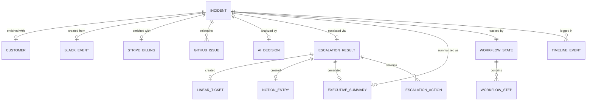

# DATA_MODEL.md

## Customer Escalation Autopilot — Data Model & Schemas

Every JSON object used by the application is defined below with field names, data types, descriptions, and realistic example data.

---

## Table of Contents

1. [Customer](#1-customer)
2. [Incident](#2-incident)
3. [SlackEvent](#3-slackevent)
4. [HubSpotResponse](#4-hubspotresponse)
5. [StripeResponse](#5-striperesponse)
6. [GitHubIssue](#6-githubissue)
7. [LinearTicket](#7-linearticket)
8. [NotionEntry](#8-notionentry)
9. [ExecutiveSummary](#9-executivesummary)
10. [AIDecision](#10-aidecision)
11. [EscalationResult](#11-escalationresult)
12. [WorkflowState](#12-workflowstate)
13. [HealthCheckResponse](#13-healthcheckresponse)

---

## 1. Customer

Represents a customer record from HubSpot CRM.

| Field | Type | Description |
|---|---|---|
| `id` | `string` | Unique customer identifier |
| `email` | `string` | Primary contact email |
| `name` | `string` | Full company name |
| `contactName` | `string` | Primary contact person |
| `tier` | `"enterprise" \| "smb" \| "startup" \| "free"` | Customer tier classification |
| `contractValue` | `number` | Annual contract value in USD |
| `employeeCount` | `number` | Company size |
| `industry` | `string` | Industry vertical |
| `region` | `string` | Geographic region |
| `accountManager` | `string` | Assigned account manager |
| `healthScore` | `number` | Customer health score (0–100) |
| `churnRisk` | `"low" \| "medium" \| "high"` | Predicted churn risk |
| `openTickets` | `number` | Number of currently open support tickets |
| `lastContactDate` | `string (ISO 8601)` | Date of last interaction |
| `createdAt` | `string (ISO 8601)` | Account creation date |

### Example JSON

```json
{
  "id": "cust_01H8K3M2N4P5Q6R7",
  "email": "ops@acmecorp.com",
  "name": "Acme Corporation",
  "contactName": "Sarah Chen",
  "tier": "enterprise",
  "contractValue": 285000,
  "employeeCount": 2400,
  "industry": "Financial Services",
  "region": "North America",
  "accountManager": "James Rodriguez",
  "healthScore": 72,
  "churnRisk": "medium",
  "openTickets": 3,
  "lastContactDate": "2026-08-25T14:30:00Z",
  "createdAt": "2024-03-15T09:00:00Z"
}
```

---

## 2. Incident

The central domain object. Tracks an incident through its entire lifecycle.

| Field | Type | Description |
|---|---|---|
| `id` | `string` | Unique incident identifier |
| `title` | `string` | Short incident title |
| `description` | `string` | Full incident description |
| `source` | `"slack" \| "manual" \| "webhook"` | How the incident was created |
| `status` | `"received" \| "enriching" \| "analyzing" \| "triaged" \| "escalated" \| "resolved"` | Current lifecycle state |
| `severity` | `"low" \| "medium" \| "high" \| "critical" \| null` | Determined severity (null before triage) |
| `customerEmail` | `string` | Email used to look up customer |
| `customer` | `Customer \| null` | Enriched customer data |
| `billing` | `StripeResponse \| null` | Enriched billing data |
| `relatedIssues` | `GitHubIssue[]` | Related engineering issues |
| `aiDecision` | `AIDecision \| null` | AI analysis result |
| `escalation` | `EscalationResult \| null` | Escalation action results |
| `executiveSummary` | `ExecutiveSummary \| null` | Generated executive summary |
| `workflowState` | `WorkflowState` | Pipeline step tracking |
| `slackEvent` | `SlackEvent \| null` | Original Slack event data |
| `timeline` | `TimelineEvent[]` | Ordered list of lifecycle events |
| `createdAt` | `string (ISO 8601)` | Incident creation timestamp |
| `updatedAt` | `string (ISO 8601)` | Last update timestamp |
| `resolvedAt` | `string (ISO 8601) \| null` | Resolution timestamp |

### TimelineEvent

| Field | Type | Description |
|---|---|---|
| `id` | `string` | Unique event ID |
| `timestamp` | `string (ISO 8601)` | When the event occurred |
| `type` | `string` | Event type (e.g., `"incident_created"`, `"customer_enriched"`, `"ai_analysis_complete"`) |
| `title` | `string` | Human-readable event title |
| `description` | `string` | Event detail |
| `status` | `"success" \| "error" \| "warning"` | Event outcome |

### Example JSON

```json
{
  "id": "inc_01J9N2K4M6P8Q0R2",
  "title": "Payment processing failing for enterprise batch operations",
  "description": "Acme Corp reporting that their batch payment processing has been failing intermittently for the past 2 hours. Affecting approximately 1,200 transactions. Their finance team is unable to close end-of-month.",
  "source": "slack",
  "status": "escalated",
  "severity": "critical",
  "customerEmail": "ops@acmecorp.com",
  "customer": { "...": "see Customer schema" },
  "billing": { "...": "see StripeResponse schema" },
  "relatedIssues": [{ "...": "see GitHubIssue schema" }],
  "aiDecision": { "...": "see AIDecision schema" },
  "escalation": { "...": "see EscalationResult schema" },
  "executiveSummary": { "...": "see ExecutiveSummary schema" },
  "workflowState": { "...": "see WorkflowState schema" },
  "slackEvent": { "...": "see SlackEvent schema" },
  "timeline": [
    {
      "id": "evt_001",
      "timestamp": "2026-08-29T10:15:00Z",
      "type": "incident_created",
      "title": "Incident Created",
      "description": "Incident received from Slack #support-escalations",
      "status": "success"
    },
    {
      "id": "evt_002",
      "timestamp": "2026-08-29T10:15:02Z",
      "type": "customer_enriched",
      "title": "Customer Context Retrieved",
      "description": "HubSpot: Acme Corporation (Enterprise, $285K ACV)",
      "status": "success"
    },
    {
      "id": "evt_003",
      "timestamp": "2026-08-29T10:15:03Z",
      "type": "billing_enriched",
      "title": "Billing Status Retrieved",
      "description": "Stripe: Active subscription, current on payments",
      "status": "success"
    },
    {
      "id": "evt_004",
      "timestamp": "2026-08-29T10:15:05Z",
      "type": "issues_enriched",
      "title": "Related Issues Found",
      "description": "GitHub: 2 related open issues found",
      "status": "success"
    },
    {
      "id": "evt_005",
      "timestamp": "2026-08-29T10:15:08Z",
      "type": "ai_analysis_complete",
      "title": "AI Analysis Complete",
      "description": "Gemini: CRITICAL severity (confidence: 0.94)",
      "status": "success"
    },
    {
      "id": "evt_006",
      "timestamp": "2026-08-29T10:15:10Z",
      "type": "escalation_complete",
      "title": "Escalation Complete",
      "description": "Linear ticket created, Slack notified, Notion updated, Email sent",
      "status": "success"
    }
  ],
  "createdAt": "2026-08-29T10:15:00Z",
  "updatedAt": "2026-08-29T10:15:10Z",
  "resolvedAt": null
}
```

---

## 3. SlackEvent

Represents an incoming Slack message event that triggers the pipeline.

| Field | Type | Description |
|---|---|---|
| `eventId` | `string` | Slack event ID |
| `type` | `string` | Event type (always `"message"`) |
| `channel` | `string` | Slack channel name |
| `channelId` | `string` | Slack channel ID |
| `userId` | `string` | Slack user ID of the reporter |
| `userName` | `string` | Display name of the reporter |
| `text` | `string` | Full message text |
| `customerEmail` | `string` | Extracted customer email (from message or thread) |
| `timestamp` | `string` | Slack message timestamp |
| `threadTs` | `string \| null` | Thread timestamp if part of a thread |

### Example JSON

```json
{
  "eventId": "Ev06F7G8H9I0J1K2",
  "type": "message",
  "channel": "#support-escalations",
  "channelId": "C04ABCDEF12",
  "userId": "U05GHIJKL34",
  "userName": "maria.garcia",
  "text": "🚨 Acme Corp (ops@acmecorp.com) reporting batch payment processing failures. ~1200 transactions affected. Their finance team cannot close end-of-month. Customer is threatening to escalate to their VP.",
  "customerEmail": "ops@acmecorp.com",
  "timestamp": "1724929500.001234",
  "threadTs": null
}
```

---

## 4. HubSpotResponse

Response from the HubSpot CRM adapter when looking up a customer.

| Field | Type | Description |
|---|---|---|
| `success` | `boolean` | Whether the lookup was successful |
| `customer` | `Customer \| null` | Customer data if found |
| `source` | `"hubspot"` | Integration source identifier |
| `retrievedAt` | `string (ISO 8601)` | Timestamp of data retrieval |
| `cached` | `boolean` | Whether the response was from cache |
| `error` | `string \| null` | Error message if lookup failed |

### Example JSON

```json
{
  "success": true,
  "customer": {
    "id": "cust_01H8K3M2N4P5Q6R7",
    "email": "ops@acmecorp.com",
    "name": "Acme Corporation",
    "contactName": "Sarah Chen",
    "tier": "enterprise",
    "contractValue": 285000,
    "employeeCount": 2400,
    "industry": "Financial Services",
    "region": "North America",
    "accountManager": "James Rodriguez",
    "healthScore": 72,
    "churnRisk": "medium",
    "openTickets": 3,
    "lastContactDate": "2026-08-25T14:30:00Z",
    "createdAt": "2024-03-15T09:00:00Z"
  },
  "source": "hubspot",
  "retrievedAt": "2026-08-29T10:15:02Z",
  "cached": false,
  "error": null
}
```

---

## 5. StripeResponse

Response from the Stripe billing adapter.

| Field | Type | Description |
|---|---|---|
| `success` | `boolean` | Whether the lookup was successful |
| `billing` | `StripeBilling \| null` | Billing data if found |
| `source` | `"stripe"` | Integration source identifier |
| `retrievedAt` | `string (ISO 8601)` | Timestamp of data retrieval |
| `error` | `string \| null` | Error message if lookup failed |

### StripeBilling

| Field | Type | Description |
|---|---|---|
| `customerId` | `string` | Stripe customer ID |
| `subscriptionStatus` | `"active" \| "past_due" \| "canceled" \| "trialing" \| "unpaid"` | Subscription status |
| `plan` | `string` | Current plan name |
| `mrr` | `number` | Monthly recurring revenue in USD |
| `totalSpend` | `number` | Lifetime total spend in USD |
| `lastPaymentDate` | `string (ISO 8601)` | Date of last successful payment |
| `lastPaymentAmount` | `number` | Amount of last payment |
| `failedPayments` | `number` | Count of failed payment attempts |
| `paymentMethod` | `string` | Payment method type |
| `billingEmail` | `string` | Billing contact email |
| `nextInvoiceDate` | `string (ISO 8601)` | Next scheduled invoice date |

### Example JSON

```json
{
  "success": true,
  "billing": {
    "customerId": "cus_Qk8M3nP2rT4vW6",
    "subscriptionStatus": "active",
    "plan": "Enterprise Annual",
    "mrr": 23750,
    "totalSpend": 570000,
    "lastPaymentDate": "2026-08-01T00:00:00Z",
    "lastPaymentAmount": 23750,
    "failedPayments": 0,
    "paymentMethod": "card",
    "billingEmail": "billing@acmecorp.com",
    "nextInvoiceDate": "2026-09-01T00:00:00Z"
  },
  "source": "stripe",
  "retrievedAt": "2026-08-29T10:15:03Z",
  "error": null
}
```

---

## 6. GitHubIssue

Represents a GitHub issue that may be related to the incident.

| Field | Type | Description |
|---|---|---|
| `id` | `string` | GitHub issue ID |
| `number` | `number` | Issue number |
| `title` | `string` | Issue title |
| `state` | `"open" \| "closed"` | Issue state |
| `body` | `string` | Issue body / description |
| `labels` | `string[]` | Issue labels |
| `assignee` | `string \| null` | Assigned developer |
| `repository` | `string` | Repository name |
| `url` | `string` | GitHub issue URL |
| `createdAt` | `string (ISO 8601)` | Issue creation date |
| `updatedAt` | `string (ISO 8601)` | Last update date |
| `closedAt` | `string (ISO 8601) \| null` | Close date if resolved |
| `relevanceScore` | `number` | AI-computed relevance to current incident (0.0–1.0) |

### Example JSON

```json
{
  "id": "issue_8923471",
  "number": 1847,
  "title": "Batch payment processor timeout under high concurrency",
  "state": "open",
  "body": "When processing more than 500 concurrent payment requests, the batch processor times out after 30 seconds. This appears to be a connection pool exhaustion issue in the payment gateway adapter.",
  "labels": ["bug", "payments", "P1", "backend"],
  "assignee": "alex.kumar",
  "repository": "platform-core",
  "url": "https://github.com/company/platform-core/issues/1847",
  "createdAt": "2026-08-20T09:30:00Z",
  "updatedAt": "2026-08-28T16:45:00Z",
  "closedAt": null,
  "relevanceScore": 0.92
}
```

---

## 7. LinearTicket

Represents an engineering ticket created in Linear as part of escalation.

| Field | Type | Description |
|---|---|---|
| `id` | `string` | Linear ticket ID |
| `identifier` | `string` | Human-readable ticket identifier (e.g., `ENG-1234`) |
| `title` | `string` | Ticket title |
| `description` | `string` | Full ticket description with context |
| `priority` | `1 \| 2 \| 3 \| 4` | Priority (1=Urgent, 2=High, 3=Medium, 4=Low) |
| `status` | `"backlog" \| "todo" \| "in_progress" \| "done" \| "canceled"` | Ticket status |
| `assignee` | `string \| null` | Assigned team member |
| `teamId` | `string` | Team identifier |
| `labels` | `string[]` | Ticket labels |
| `incidentId` | `string` | Linked incident ID |
| `url` | `string` | Linear ticket URL |
| `createdAt` | `string (ISO 8601)` | Ticket creation date |

### Example JSON

```json
{
  "id": "lin_01J9N2K4M6P8",
  "identifier": "ENG-2847",
  "title": "[CRITICAL] Payment processing failure — Acme Corporation",
  "description": "## Incident Summary\n\n**Customer:** Acme Corporation (Enterprise, $285K ACV)\n**Impact:** ~1,200 batch transactions failing\n**Severity:** CRITICAL\n\n## Context\n- Batch payment processing has been failing intermittently for 2 hours\n- Finance team unable to close end-of-month\n- Related to existing issue #1847 (batch processor timeout)\n\n## AI Analysis\nConnection pool exhaustion in payment gateway adapter under high concurrency. Likely regression from recent deployment.\n\n## Action Required\nImmediate investigation of payment gateway adapter connection pooling.",
  "priority": 1,
  "status": "todo",
  "assignee": "alex.kumar",
  "teamId": "team_engineering",
  "labels": ["incident", "critical", "payments", "enterprise"],
  "incidentId": "inc_01J9N2K4M6P8Q0R2",
  "url": "https://linear.app/company/issue/ENG-2847",
  "createdAt": "2026-08-29T10:15:09Z"
}
```

---

## 8. NotionEntry

Represents an incident log entry in Notion.

| Field | Type | Description |
|---|---|---|
| `id` | `string` | Notion page ID |
| `incidentId` | `string` | Linked incident ID |
| `title` | `string` | Incident title |
| `severity` | `"low" \| "medium" \| "high" \| "critical"` | Severity level |
| `customer` | `string` | Customer name |
| `customerTier` | `string` | Customer tier |
| `status` | `string` | Current incident status |
| `summary` | `string` | Brief incident summary |
| `aiConfidence` | `number` | AI confidence score |
| `linearTicket` | `string \| null` | Linked Linear ticket identifier |
| `assignee` | `string \| null` | Assigned engineer |
| `impactScope` | `string` | Scope of business impact |
| `rootCause` | `string \| null` | Identified root cause |
| `resolution` | `string \| null` | Resolution steps taken |
| `createdAt` | `string (ISO 8601)` | Entry creation date |
| `updatedAt` | `string (ISO 8601)` | Last update date |
| `url` | `string` | Notion page URL |

### Example JSON

```json
{
  "id": "notion_pg_01J9N2K4",
  "incidentId": "inc_01J9N2K4M6P8Q0R2",
  "title": "Payment processing failure — Acme Corporation",
  "severity": "critical",
  "customer": "Acme Corporation",
  "customerTier": "enterprise",
  "status": "escalated",
  "summary": "Batch payment processing failing for enterprise customer Acme Corp. ~1,200 transactions affected. Finance team blocked on end-of-month close.",
  "aiConfidence": 0.94,
  "linearTicket": "ENG-2847",
  "assignee": "alex.kumar",
  "impactScope": "Revenue-critical: $285K ACV customer, 1,200 transactions blocked",
  "rootCause": null,
  "resolution": null,
  "createdAt": "2026-08-29T10:15:10Z",
  "updatedAt": "2026-08-29T10:15:10Z",
  "url": "https://notion.so/company/incident-log/pg_01J9N2K4"
}
```

---

## 9. ExecutiveSummary

AI-generated executive summary for stakeholder communication.

| Field | Type | Description |
|---|---|---|
| `id` | `string` | Summary ID |
| `incidentId` | `string` | Linked incident ID |
| `title` | `string` | Summary headline |
| `severity` | `"low" \| "medium" \| "high" \| "critical"` | Severity level |
| `customerImpact` | `string` | Business impact description |
| `technicalSummary` | `string` | Technical root cause analysis |
| `actionsTaken` | `string[]` | List of automated actions taken |
| `recommendedNextSteps` | `string[]` | Suggested follow-up actions |
| `timeline` | `string` | Chronological summary of events |
| `riskAssessment` | `string` | Business risk evaluation |
| `generatedBy` | `"gemini-3.7-flash" \| "rule-based"` | Which system generated the summary |
| `generatedAt` | `string (ISO 8601)` | Generation timestamp |

### Example JSON

```json
{
  "id": "sum_01J9N2K4M6P8",
  "incidentId": "inc_01J9N2K4M6P8Q0R2",
  "title": "CRITICAL: Batch Payment Processing Failure — Acme Corporation",
  "severity": "critical",
  "customerImpact": "Acme Corporation (Enterprise, $285K ACV) is unable to process approximately 1,200 batch payment transactions. Their finance team is blocked from completing end-of-month reconciliation. Customer contact has indicated intent to escalate to VP-level within their organization.",
  "technicalSummary": "The batch payment processor is experiencing intermittent timeouts under high concurrency conditions. Initial analysis suggests connection pool exhaustion in the payment gateway adapter, consistent with existing issue #1847. This may be a regression from the v2.14.3 deployment on August 27.",
  "actionsTaken": [
    "Created Linear ticket ENG-2847 (Priority: Urgent)",
    "Assigned to alex.kumar (Payment Systems team lead)",
    "Notified #engineering-critical Slack channel",
    "Updated Notion incident log",
    "Sent executive summary to leadership distribution list"
  ],
  "recommendedNextSteps": [
    "Investigate connection pool configuration in payment gateway adapter",
    "Consider rollback of v2.14.3 if root cause is confirmed as regression",
    "Provide Acme Corp with status update within 30 minutes",
    "Schedule post-incident review once resolved"
  ],
  "timeline": "10:15 AM — Incident reported via Slack by maria.garcia. 10:15 AM — Customer identified as Acme Corporation (Enterprise). 10:15 AM — AI analysis classified as CRITICAL severity (94% confidence). 10:15 AM — Escalation actions completed: ticket, notification, log, email.",
  "riskAssessment": "HIGH RISK — Enterprise customer with $285K ACV and medium churn risk. Payment processing is a core business function. Extended outage may trigger contractual SLA penalties and executive-level escalation.",
  "generatedBy": "gemini-3.7-flash",
  "generatedAt": "2026-08-29T10:15:10Z"
}
```

---

## 10. AIDecision

Structured output from Gemini 3.7 Flash analysis.

| Field | Type | Description |
|---|---|---|
| `severity` | `"low" \| "medium" \| "high" \| "critical"` | AI-determined severity level |
| `confidence` | `number` | Confidence score (0.0–1.0) |
| `reasoning` | `string` | Detailed reasoning for the severity classification |
| `businessImpact` | `string` | Assessment of business impact |
| `technicalAssessment` | `string` | Technical analysis of the issue |
| `recommendedActions` | `string[]` | Suggested actions to take |
| `shouldEscalate` | `boolean` | Whether escalation is recommended |
| `escalationReason` | `string \| null` | Reason for escalation recommendation |
| `executiveSummary` | `string` | Concise summary suitable for executives |
| `relatedIssueAnalysis` | `string` | Analysis of how existing GitHub issues relate |
| `estimatedResolutionTime` | `string` | Estimated time to resolve |
| `riskFactors` | `string[]` | Identified risk factors |
| `model` | `string` | AI model used |
| `tokensUsed` | `number` | Token count for the request |
| `latencyMs` | `number` | AI response latency in milliseconds |
| `analyzedAt` | `string (ISO 8601)` | Analysis timestamp |

### Example JSON

```json
{
  "severity": "critical",
  "confidence": 0.94,
  "reasoning": "This incident warrants CRITICAL severity based on multiple converging factors: (1) The affected customer is an Enterprise-tier account with $285K ACV and existing medium churn risk. (2) The technical issue — batch payment processing failure — directly impacts a revenue-critical business function. (3) Approximately 1,200 transactions are affected, indicating broad operational impact. (4) The issue has persisted for 2 hours with no resolution. (5) There is a directly related open issue (#1847) suggesting a known but unresolved root cause. (6) The customer's finance team is blocked on end-of-month close, creating time pressure.",
  "businessImpact": "Revenue-critical impact on an Enterprise customer ($285K ACV). 1,200 transactions blocked. End-of-month financial close at risk. Customer contact threatening VP-level escalation. Medium churn risk customer — extended outage likely increases churn probability.",
  "technicalAssessment": "Batch payment processor timeout consistent with connection pool exhaustion under high concurrency (see issue #1847). Likely regression from recent deployment. Payment gateway adapter connection pooling configuration needs investigation.",
  "recommendedActions": [
    "Immediately assign senior payment systems engineer",
    "Investigate connection pool settings in payment gateway adapter",
    "Evaluate rollback of v2.14.3 deployment",
    "Provide customer status update within 30 minutes",
    "Prepare contingency plan for manual transaction processing"
  ],
  "shouldEscalate": true,
  "escalationReason": "Enterprise customer with critical business impact. Revenue-affecting issue with high churn risk. Related known issue suggests systemic problem.",
  "executiveSummary": "Acme Corporation (Enterprise, $285K ACV) is experiencing batch payment processing failures affecting ~1,200 transactions. Their finance team is blocked on end-of-month close. Root cause likely related to known issue #1847 (connection pool exhaustion). Immediate engineering attention required.",
  "relatedIssueAnalysis": "Issue #1847 ('Batch payment processor timeout under high concurrency') is directly related. Opened 9 days ago, assigned to alex.kumar, labeled P1. The current incident matches the described symptoms exactly, suggesting the fix has not been deployed or the issue has regressed.",
  "estimatedResolutionTime": "2-4 hours (if connection pool fix); 30 minutes (if rollback is viable)",
  "riskFactors": [
    "Enterprise customer with existing churn risk",
    "Revenue-critical business function affected",
    "Known related issue suggests systemic problem",
    "End-of-month timing creates additional urgency",
    "Customer threatening executive escalation"
  ],
  "model": "gemini-3.7-flash",
  "tokensUsed": 2847,
  "latencyMs": 1230,
  "analyzedAt": "2026-08-29T10:15:08Z"
}
```

---

## 11. EscalationResult

Tracks the outcome of all escalation actions.

| Field | Type | Description |
|---|---|---|
| `incidentId` | `string` | The incident that was escalated |
| `escalated` | `boolean` | Whether escalation was performed |
| `reason` | `string` | Why escalation was or was not performed |
| `actions` | `EscalationAction[]` | Individual action results |
| `linearTicket` | `LinearTicket \| null` | Created ticket if applicable |
| `notionEntry` | `NotionEntry \| null` | Created Notion entry if applicable |
| `executiveSummary` | `ExecutiveSummary \| null` | Generated summary if applicable |
| `completedAt` | `string (ISO 8601)` | Escalation completion timestamp |
| `partialFailure` | `boolean` | Whether some actions failed |
| `errors` | `string[]` | Error messages for failed actions |

### EscalationAction

| Field | Type | Description |
|---|---|---|
| `action` | `"create_linear_ticket" \| "notify_slack" \| "generate_summary" \| "update_notion" \| "send_email"` | Action type |
| `status` | `"success" \| "failed" \| "skipped"` | Action outcome |
| `message` | `string` | Description of what happened |
| `durationMs` | `number` | Time taken for this action |
| `error` | `string \| null` | Error message if failed |

### Example JSON

```json
{
  "incidentId": "inc_01J9N2K4M6P8Q0R2",
  "escalated": true,
  "reason": "Enterprise customer with CRITICAL severity and AI recommendation to escalate",
  "actions": [
    {
      "action": "create_linear_ticket",
      "status": "success",
      "message": "Created ticket ENG-2847 (Priority: Urgent, Assignee: alex.kumar)",
      "durationMs": 340,
      "error": null
    },
    {
      "action": "notify_slack",
      "status": "success",
      "message": "Notified #engineering-critical with incident details",
      "durationMs": 180,
      "error": null
    },
    {
      "action": "generate_summary",
      "status": "success",
      "message": "Executive summary generated (gemini-3.7-flash)",
      "durationMs": 890,
      "error": null
    },
    {
      "action": "update_notion",
      "status": "success",
      "message": "Incident log entry created in Notion",
      "durationMs": 250,
      "error": null
    },
    {
      "action": "send_email",
      "status": "success",
      "message": "Summary emailed to leadership@company.com",
      "durationMs": 420,
      "error": null
    }
  ],
  "linearTicket": { "...": "see LinearTicket schema" },
  "notionEntry": { "...": "see NotionEntry schema" },
  "executiveSummary": { "...": "see ExecutiveSummary schema" },
  "completedAt": "2026-08-29T10:15:10Z",
  "partialFailure": false,
  "errors": []
}
```

---

## 12. WorkflowState

Tracks the progress of each step in the processing pipeline.

| Field | Type | Description |
|---|---|---|
| `incidentId` | `string` | Associated incident ID |
| `currentStep` | `string` | Currently executing step |
| `steps` | `WorkflowStep[]` | Ordered list of pipeline steps |
| `startedAt` | `string (ISO 8601)` | Pipeline start time |
| `completedAt` | `string (ISO 8601) \| null` | Pipeline completion time |
| `totalDurationMs` | `number \| null` | Total pipeline duration |
| `overallStatus` | `"running" \| "completed" \| "failed" \| "partial"` | Overall pipeline status |

### WorkflowStep

| Field | Type | Description |
|---|---|---|
| `id` | `string` | Step identifier |
| `name` | `string` | Human-readable step name |
| `description` | `string` | What this step does |
| `status` | `"pending" \| "running" \| "completed" \| "failed" \| "skipped"` | Step status |
| `startedAt` | `string (ISO 8601) \| null` | Step start time |
| `completedAt` | `string (ISO 8601) \| null` | Step completion time |
| `durationMs` | `number \| null` | Step duration in milliseconds |
| `output` | `string \| null` | Brief output summary |
| `error` | `string \| null` | Error message if failed |
| `icon` | `string` | Emoji or icon identifier for the step |

### Example JSON

```json
{
  "incidentId": "inc_01J9N2K4M6P8Q0R2",
  "currentStep": "send_email",
  "steps": [
    {
      "id": "parse_event",
      "name": "Parse Slack Event",
      "description": "Extract incident details from Slack message",
      "status": "completed",
      "startedAt": "2026-08-29T10:15:00Z",
      "completedAt": "2026-08-29T10:15:01Z",
      "durationMs": 120,
      "output": "Extracted: customer email, description, channel",
      "error": null,
      "icon": "💬"
    },
    {
      "id": "fetch_customer",
      "name": "Retrieve Customer",
      "description": "Look up customer data from HubSpot",
      "status": "completed",
      "startedAt": "2026-08-29T10:15:01Z",
      "completedAt": "2026-08-29T10:15:02Z",
      "durationMs": 450,
      "output": "Acme Corporation (Enterprise, $285K ACV)",
      "error": null,
      "icon": "👤"
    },
    {
      "id": "fetch_billing",
      "name": "Retrieve Billing",
      "description": "Look up billing status from Stripe",
      "status": "completed",
      "startedAt": "2026-08-29T10:15:02Z",
      "completedAt": "2026-08-29T10:15:03Z",
      "durationMs": 380,
      "output": "Active subscription, $23.7K MRR, current",
      "error": null,
      "icon": "💳"
    },
    {
      "id": "fetch_issues",
      "name": "Retrieve Issues",
      "description": "Search for related GitHub issues",
      "status": "completed",
      "startedAt": "2026-08-29T10:15:03Z",
      "completedAt": "2026-08-29T10:15:05Z",
      "durationMs": 520,
      "output": "2 related issues found (1 open P1)",
      "error": null,
      "icon": "🔧"
    },
    {
      "id": "ai_analysis",
      "name": "AI Analysis",
      "description": "Gemini 3.7 Flash severity analysis",
      "status": "completed",
      "startedAt": "2026-08-29T10:15:05Z",
      "completedAt": "2026-08-29T10:15:08Z",
      "durationMs": 1230,
      "output": "CRITICAL (94% confidence)",
      "error": null,
      "icon": "🤖"
    },
    {
      "id": "create_ticket",
      "name": "Create Linear Ticket",
      "description": "Create engineering work item",
      "status": "completed",
      "startedAt": "2026-08-29T10:15:08Z",
      "completedAt": "2026-08-29T10:15:09Z",
      "durationMs": 340,
      "output": "ENG-2847 created (Urgent)",
      "error": null,
      "icon": "🎫"
    },
    {
      "id": "notify_slack",
      "name": "Notify Engineering",
      "description": "Post alert to engineering Slack channel",
      "status": "completed",
      "startedAt": "2026-08-29T10:15:09Z",
      "completedAt": "2026-08-29T10:15:09Z",
      "durationMs": 180,
      "output": "Posted to #engineering-critical",
      "error": null,
      "icon": "📢"
    },
    {
      "id": "generate_summary",
      "name": "Generate Summary",
      "description": "Create executive incident summary",
      "status": "completed",
      "startedAt": "2026-08-29T10:15:09Z",
      "completedAt": "2026-08-29T10:15:10Z",
      "durationMs": 890,
      "output": "Executive summary generated",
      "error": null,
      "icon": "📋"
    },
    {
      "id": "update_notion",
      "name": "Update Notion",
      "description": "Add entry to incident log",
      "status": "completed",
      "startedAt": "2026-08-29T10:15:10Z",
      "completedAt": "2026-08-29T10:15:10Z",
      "durationMs": 250,
      "output": "Incident log updated",
      "error": null,
      "icon": "📓"
    },
    {
      "id": "send_email",
      "name": "Send Email",
      "description": "Email summary to leadership",
      "status": "completed",
      "startedAt": "2026-08-29T10:15:10Z",
      "completedAt": "2026-08-29T10:15:10Z",
      "durationMs": 420,
      "output": "Email sent to leadership@company.com",
      "error": null,
      "icon": "📧"
    }
  ],
  "startedAt": "2026-08-29T10:15:00Z",
  "completedAt": "2026-08-29T10:15:10Z",
  "totalDurationMs": 4780,
  "overallStatus": "completed"
}
```

---

## 13. HealthCheckResponse

Response from the service health monitoring system.

| Field | Type | Description |
|---|---|---|
| `service` | `string` | Service name (e.g., `"hubspot"`, `"stripe"`) |
| `displayName` | `string` | Human-readable service name |
| `status` | `"healthy" \| "degraded" \| "down" \| "unknown"` | Current status |
| `responseTimeMs` | `number \| null` | Last measured response time |
| `lastChecked` | `string (ISO 8601)` | When the health check ran |
| `lastSuccessful` | `string (ISO 8601) \| null` | Last successful check |
| `uptime` | `number` | Uptime percentage (0–100) over last 24 hours |
| `consecutiveFailures` | `number` | Number of consecutive failed checks |
| `error` | `string \| null` | Error message if unhealthy |
| `metadata` | `object` | Service-specific metadata |

### Example JSON (Full Health Check Array)

```json
[
  {
    "service": "hubspot",
    "displayName": "HubSpot CRM",
    "status": "healthy",
    "responseTimeMs": 145,
    "lastChecked": "2026-08-29T10:14:30Z",
    "lastSuccessful": "2026-08-29T10:14:30Z",
    "uptime": 99.8,
    "consecutiveFailures": 0,
    "error": null,
    "metadata": { "recordsAvailable": 5, "cacheHitRate": 0.85 }
  },
  {
    "service": "stripe",
    "displayName": "Stripe Billing",
    "status": "healthy",
    "responseTimeMs": 92,
    "lastChecked": "2026-08-29T10:14:30Z",
    "lastSuccessful": "2026-08-29T10:14:30Z",
    "uptime": 100.0,
    "consecutiveFailures": 0,
    "error": null,
    "metadata": { "accountsAvailable": 5 }
  },
  {
    "service": "github",
    "displayName": "GitHub Issues",
    "status": "healthy",
    "responseTimeMs": 210,
    "lastChecked": "2026-08-29T10:14:30Z",
    "lastSuccessful": "2026-08-29T10:14:30Z",
    "uptime": 99.5,
    "consecutiveFailures": 0,
    "error": null,
    "metadata": { "issuesIndexed": 10 }
  },
  {
    "service": "linear",
    "displayName": "Linear",
    "status": "healthy",
    "responseTimeMs": 78,
    "lastChecked": "2026-08-29T10:14:30Z",
    "lastSuccessful": "2026-08-29T10:14:30Z",
    "uptime": 100.0,
    "consecutiveFailures": 0,
    "error": null,
    "metadata": { "ticketsCreated": 12 }
  },
  {
    "service": "slack",
    "displayName": "Slack",
    "status": "healthy",
    "responseTimeMs": 65,
    "lastChecked": "2026-08-29T10:14:30Z",
    "lastSuccessful": "2026-08-29T10:14:30Z",
    "uptime": 100.0,
    "consecutiveFailures": 0,
    "error": null,
    "metadata": { "notificationsSent": 8 }
  },
  {
    "service": "notion",
    "displayName": "Notion",
    "status": "degraded",
    "responseTimeMs": 1850,
    "lastChecked": "2026-08-29T10:14:30Z",
    "lastSuccessful": "2026-08-29T10:09:30Z",
    "uptime": 97.2,
    "consecutiveFailures": 1,
    "error": "Response time exceeded 1000ms threshold",
    "metadata": { "entriesCreated": 15 }
  },
  {
    "service": "email",
    "displayName": "Email Service",
    "status": "healthy",
    "responseTimeMs": 320,
    "lastChecked": "2026-08-29T10:14:30Z",
    "lastSuccessful": "2026-08-29T10:14:30Z",
    "uptime": 99.9,
    "consecutiveFailures": 0,
    "error": null,
    "metadata": { "emailsSent": 6 }
  },
  {
    "service": "gemini",
    "displayName": "Gemini AI",
    "status": "healthy",
    "responseTimeMs": 1230,
    "lastChecked": "2026-08-29T10:14:30Z",
    "lastSuccessful": "2026-08-29T10:14:30Z",
    "uptime": 99.7,
    "consecutiveFailures": 0,
    "error": null,
    "metadata": { "mode": "mock", "analysesCompleted": 5 }
  }
]
```

---

## Schema Relationships


