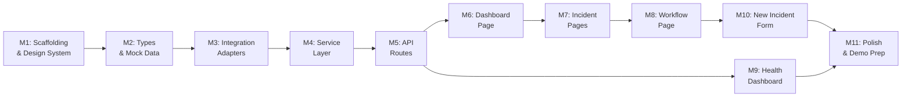

# IMPLEMENTATION_PLAN.md

## Customer Escalation Autopilot — Implementation Roadmap

This document defines the implementation milestones in the order they should be built. Each milestone is self-contained and produces a testable, demonstrable increment.

**Total estimated time: 16–18 hours**

---

## Milestone 1: Project Scaffolding & Design System ✅

### Objective
Initialize the Next.js project with TypeScript, Tailwind CSS, and establish the design system foundation — color palette, typography, layout shell, and reusable UI primitives.

### Files to Create
- `package.json` (via `npx create-next-app`)
- `tailwind.config.ts` — custom theme (dark mode, brand colors, typography)
- `src/app/globals.css` — Tailwind directives + custom CSS variables
- `src/app/layout.tsx` — Root layout with font imports and metadata
- `src/app/page.tsx` — Placeholder dashboard
- `src/components/layout/app-shell.tsx` — Main layout wrapper (sidebar + content)
- `src/components/layout/sidebar.tsx` — Navigation sidebar
- `src/components/layout/header.tsx` — Page header with breadcrumbs
- `src/components/ui/badge.tsx` — Severity/status badges
- `src/components/ui/card.tsx` — Content card container
- `src/components/ui/button.tsx` — Action buttons
- `src/components/ui/skeleton.tsx` — Loading skeleton placeholders
- `src/components/ui/status-indicator.tsx` — Health status dot/pill
- `src/components/ui/progress-bar.tsx` — Step progress indicator
- `.env.example` — Environment variable template
- `next.config.js` — Next.js configuration

### Dependencies
- None (first milestone)

### Expected Output
- Running Next.js dev server at `http://localhost:3000`
- Dark-themed, enterprise-quality sidebar layout
- All UI primitives rendering correctly with Tailwind
- Responsive layout that works on desktop and tablet

### Acceptance Criteria
- [x] `npm run dev` starts without errors
- [x] Root page renders the app shell with sidebar navigation
- [x] Sidebar shows navigation links: Dashboard, Incidents, Workflow, Health
- [x] All UI primitives render correctly in isolation
- [x] Dark theme applied consistently
- [x] Responsive at 1024px and above

### Estimated Time
**2.5 hours**

### Suggested LatentCode Prompt

> Initialize a Next.js 14 project with TypeScript and Tailwind CSS. Create a premium enterprise design system with a dark theme. Build an AppShell layout with a collapsible sidebar (navigation: Dashboard, Incidents, Workflow, Health) and a header with breadcrumbs. Create reusable UI primitives: Badge (variants: severity colors), Card (glass-morphism effect), Button (primary/secondary/ghost), Skeleton (shimmer loading), StatusIndicator (healthy/degraded/down dots), and ProgressBar (stepped). Use the Inter font. The aesthetic should feel like a premium SaaS monitoring dashboard — think Linear or Vercel. Refer to docs/ARCHITECTURE.md for folder structure and docs/DATA_MODEL.md for data types.

---

## Milestone 2: TypeScript Types & Mock Data ✅

### Objective
Define all TypeScript interfaces and create realistic mock JSON data files that will power the entire application until real APIs are integrated.

### Files to Create
- `src/lib/types/index.ts` — All TypeScript interfaces (Customer, Incident, SlackEvent, AIDecision, etc.)
- `src/lib/mock-data/customers.json` — 5 customer records (Enterprise, SMB, Startup, Free tiers)
- `src/lib/mock-data/incidents.json` — 5 pre-seeded incidents at various lifecycle stages
- `src/lib/mock-data/stripe-accounts.json` — 5 billing records (active, past_due, trialing)
- `src/lib/mock-data/github-issues.json` — 10 GitHub issues (open, closed, various labels)
- `src/lib/mock-data/ai-responses.json` — 5 pre-computed AI analysis responses
- `src/lib/utils/constants.ts` — Severity levels, status values, color mappings
- `src/lib/utils/formatters.ts` — Date, currency, text formatting utilities

### Dependencies
- Milestone 1 (project scaffolding)

### Expected Output
- Complete TypeScript type system matching DATA_MODEL.md
- Realistic mock data covering all happy-path and edge-case scenarios
- Utility functions for formatting dates, currencies, and severity labels

### Acceptance Criteria
- [x] All types from DATA_MODEL.md are defined
- [x] Mock data files contain realistic, internally consistent data
- [x] Customers span all tiers (enterprise, smb, startup, free)
- [x] Incidents span all lifecycle states (received → resolved)
- [x] AI responses span all severity levels
- [x] TypeScript compiles with no errors (`npx tsc --noEmit`)
- [x] Formatting utilities handle edge cases (null, undefined, empty)

### Estimated Time
**1.5 hours**

### Suggested LatentCode Prompt

> Create the complete TypeScript type system and mock data layer. Define all interfaces in `src/lib/types/index.ts` exactly as specified in docs/DATA_MODEL.md. Create mock JSON data files in `src/lib/mock-data/` with 5 realistic customer records (spanning Enterprise/SMB/Startup/Free tiers), 5 pre-seeded incidents at different lifecycle stages, 5 Stripe billing records, 10 GitHub issues, and 5 pre-computed AI analysis responses. Create utility functions in `src/lib/utils/` for date formatting, currency formatting, severity label rendering, and text truncation. Create constants for severity levels, status values, and color mappings. All data must be internally consistent — customer emails in incidents must match customer records, etc.

---

## Milestone 3: Integration Adapters (Mock) ✅

### Objective
Build the integration layer with adapter interfaces and mock implementations for all 7 external services.

### Files to Create
- `src/lib/integrations/types.ts` — Adapter interface definitions
- `src/lib/integrations/hubspot.ts` — HubSpot mock adapter
- `src/lib/integrations/stripe.ts` — Stripe mock adapter
- `src/lib/integrations/github.ts` — GitHub mock adapter
- `src/lib/integrations/linear.ts` — Linear mock adapter
- `src/lib/integrations/slack.ts` — Slack mock adapter
- `src/lib/integrations/notion.ts` — Notion mock adapter
- `src/lib/integrations/email.ts` — Email mock adapter

### Dependencies
- Milestone 2 (types and mock data)

### Expected Output
- All 7 integration adapters with consistent interfaces
- Each adapter reads from mock JSON and simulates realistic latency (100–500ms)
- Adapters are type-safe and return proper response wrappers

### Acceptance Criteria
- [x] Each adapter implements its typed interface
- [x] `getCustomerByEmail("ops@acmecorp.com")` returns the Acme Corp customer
- [x] `getBillingStatus("cust_01H8K3M2N4P5Q6R7")` returns billing data
- [x] `getRelatedIssues("payment processing")` returns matching issues
- [x] `createTicket(...)` returns a valid LinearTicket
- [x] All adapters simulate latency with configurable delay
- [x] Each adapter has a `healthCheck()` method returning HealthCheckResponse

### Estimated Time
**1.5 hours**

### Suggested LatentCode Prompt

> Build the integration adapter layer in `src/lib/integrations/`. First define adapter interfaces in `types.ts` for HubSpot, Stripe, GitHub, Linear, Slack, Notion, and Email. Then implement mock versions that read from the JSON files in `src/lib/mock-data/`. Each adapter should: (1) implement its typed interface, (2) simulate realistic API latency (100-500ms random delay), (3) include a `healthCheck()` method returning HealthCheckResponse, (4) support lookup by relevant identifiers (email, customer ID, search query). This follows the api-integration SkillPatch pattern for adapter-based API abstraction. Refer to docs/ARCHITECTURE.md section 9 (Mock API Architecture) and docs/DATA_MODEL.md for all response schemas.

---

## Milestone 4: Service Layer — AI Pipeline & Triage ✅

### Objective
Build the core business logic: the AI pipeline service (Gemini integration with mock fallback), triage service (severity classification + escalation rules), and escalation service (action dispatcher).

### Files to Create
- `src/lib/services/ai-pipeline.ts` — AI prompt building, Gemini calling (or mock), response parsing
- `src/lib/services/triage.ts` — Severity classification, escalation decision logic
- `src/lib/services/escalation.ts` — Escalation action executor (Linear, Slack, Notion, Email)
- `src/lib/services/orchestrator.ts` — Main workflow engine coordinating all services

### Dependencies
- Milestone 3 (integration adapters)

### Expected Output
- Orchestrator that runs the full incident pipeline end-to-end
- AI pipeline with mock fallback (works without API key)
- Triage service with business rules for enterprise escalation
- Escalation service that dispatches all 5 actions

### Acceptance Criteria
- [x] `orchestrator.processIncident(slackEvent)` executes the full pipeline
- [x] AI pipeline returns structured `AIDecision` matching the schema
- [x] Triage correctly escalates: Enterprise at Medium+, all customers at Critical
- [x] Triage correctly skips escalation: Free/Startup at Low
- [x] Escalation service executes all 5 actions and reports results
- [x] Graceful degradation when an integration fails
- [x] WorkflowState tracks each step with timestamps and durations
- [x] Timeline events are generated for each pipeline step

### Estimated Time
**2.5 hours**

### Suggested LatentCode Prompt

> Build the service layer in `src/lib/services/`. Create four services: (1) AIPipelineService — builds structured prompts with customer/billing/issue context, calls mock AI (returns pre-computed responses from ai-responses.json matched by keywords), parses the structured AIDecision response. When GEMINI_API_KEY is set, call the real Gemini 3.7 Flash API. (2) TriageService — classifies severity using the AI decision, applies escalation rules: Enterprise customers escalate at Medium+, all customers escalate at Critical, Free/Startup only escalate at Critical. (3) EscalationService — executes 5 actions (create Linear ticket, notify Slack, generate executive summary, update Notion, send email) using the integration adapters. Reports partial success if some fail. (4) OrchestratorService — coordinates the full pipeline: parse event → enrich (HubSpot, Stripe, GitHub) → AI analysis → triage → escalate. Manages WorkflowState with step-by-step tracking. This uses triage and api-ai-augmented SkillPatch patterns. Refer to docs/ARCHITECTURE.md sections 6, 13 and docs/DATA_MODEL.md for all schemas.

---

## Milestone 5: API Routes ✅

### Objective
Create all Next.js API routes that expose the service layer to the frontend.

### Files to Create
- `src/app/api/webhook/slack/route.ts` — POST: Slack event webhook
- `src/app/api/incidents/route.ts` — GET: list, POST: create incident
- `src/app/api/incidents/[id]/route.ts` — GET: single incident
- `src/app/api/escalate/route.ts` — POST: trigger escalation
- `src/app/api/health/route.ts` — GET: service health check
- `src/lib/utils/health-monitor.ts` — Health check aggregator

### Dependencies
- Milestone 4 (service layer)

### Expected Output
- All API routes functional and returning correct response shapes
- Health endpoint checks all services
- Error responses follow consistent format

### Acceptance Criteria
- [x] `POST /api/webhook/slack` accepts SlackEvent and returns 202 with incident ID
- [x] `GET /api/incidents` returns list of incidents with optional filtering
- [x] `POST /api/incidents` creates and processes a new incident
- [x] `GET /api/incidents/[id]` returns full incident detail
- [x] `POST /api/escalate` triggers escalation for an incident
- [x] `GET /api/health` returns health status for all 8 services
- [x] All routes return consistent error format on failure
- [x] Routes can be tested with `curl` or Postman

### Estimated Time
**1.5 hours**

### Suggested LatentCode Prompt

> Create all Next.js API routes in `src/app/api/`. Implement: (1) POST `/api/webhook/slack` — validates and parses SlackEvent, calls orchestrator.processIncident(), returns 202. (2) GET `/api/incidents` — lists incidents with optional query params (?severity, ?status, ?limit). POST `/api/incidents` — creates incident from manual form submission. (3) GET `/api/incidents/[id]` — returns full incident with all enriched data. (4) POST `/api/escalate` — triggers escalation for a given incidentId. (5) GET `/api/health` — aggregates health checks across all services using the health monitor utility. All routes should use consistent error response format: { error: { code, message, details } }. Create the health-monitor utility in `src/lib/utils/health-monitor.ts` that pings each adapter's healthCheck() method. This uses api-health-monitoring SkillPatch pattern. Refer to docs/ARCHITECTURE.md section 5 for API design.

---

## Milestone 6: Dashboard Page ✅

### Objective
Build the main dashboard page with summary statistics, recent incidents, severity distribution, and quick action buttons.

### Files to Create
- `src/app/page.tsx` — Dashboard page (replace placeholder)
- `src/components/dashboard/stats-grid.tsx` — Summary metric cards (total incidents, critical, avg resolution time, active escalations)
- `src/components/dashboard/recent-incidents.tsx` — Recent incidents table with severity badges
- `src/components/dashboard/severity-chart.tsx` — Severity distribution visualization
- `src/components/dashboard/quick-actions.tsx` — Quick action buttons (New Incident, Check Health)

### Dependencies
- Milestone 5 (API routes)

### Expected Output
- Polished dashboard page with real-time data from API
- Summary stats with animated counters
- Recent incidents table with clickable rows
- Visual severity distribution chart
- Quick action buttons that navigate or open forms

### Acceptance Criteria
- [x] Dashboard loads and displays data from `/api/incidents`
- [x] Stats grid shows: Total Incidents, Critical, Avg Response Time, Active Escalations
- [x] Recent incidents table shows last 5 incidents with severity badges
- [x] Clicking an incident navigates to `/incidents/[id]`
- [x] Quick actions work: "New Incident" opens form, "Check Health" navigates to /health
- [x] Loading skeletons display while data fetches
- [x] Empty state displays when no incidents exist

### Estimated Time
**2 hours**

### Suggested LatentCode Prompt

> Build the Dashboard page at `src/app/page.tsx`. Create four dashboard components: (1) StatsGrid — 4 metric cards showing Total Incidents, Critical Count, Avg Response Time, and Active Escalations. Use animated number counters. Cards should have subtle glass-morphism effects. (2) RecentIncidents — table showing the 5 most recent incidents with columns: Title, Customer, Severity (badge), Status (badge), Time. Rows are clickable and navigate to /incidents/[id]. (3) SeverityChart — visual bar/donut chart showing distribution across Low/Medium/High/Critical. Use Tailwind for the chart (no charting library needed — CSS bars are fine). (4) QuickActions — buttons for "New Incident" and "Check Health". Fetch data from GET /api/incidents. Show skeleton loading states while fetching. Show empty state with illustration when no incidents exist. Follow the premium dark-theme enterprise aesthetic. Refer to docs/ARCHITECTURE.md section 4 for component hierarchy.

---

## Milestone 7: Incident Pages (List + Detail) ✅

### Objective
Build the incident list page (with filtering) and the incident detail page (full context, AI reasoning, escalation results, timeline).

### Files to Create
- `src/app/incidents/page.tsx` — Incident list page
- `src/app/incidents/[id]/page.tsx` — Incident detail page
- `src/components/incidents/incident-card.tsx` — Incident summary card for list view
- `src/components/incidents/incident-detail.tsx` — Full incident detail layout
- `src/components/incidents/customer-context.tsx` — Customer 360 panel
- `src/components/incidents/ai-reasoning.tsx` — AI decision explanation display
- `src/components/incidents/escalation-actions.tsx` — Escalation results display
- `src/components/incidents/exec-summary.tsx` — Executive summary card
- `src/components/incidents/incident-timeline.tsx` — Chronological event timeline

### Dependencies
- Milestone 6 (dashboard page)

### Expected Output
- Filterable incident list page
- Rich incident detail page with all context panels
- AI reasoning display with confidence meter
- Escalation action results with success/failure indicators
- Executive summary card
- Chronological timeline with status icons

### Acceptance Criteria
- [x] Incident list page shows all incidents with severity/status badges
- [x] Filter by severity (dropdown) and status (tabs) works
- [x] Clicking an incident navigates to detail page
- [x] Detail page shows: Customer Context, AI Reasoning, Escalation Actions, Executive Summary, Timeline
- [x] Customer context shows: name, tier, contract value, health score, churn risk
- [x] AI reasoning shows: severity badge, confidence meter, full reasoning text, recommended actions
- [x] Escalation actions show each action with success/failure status
- [x] Timeline shows chronological events with timestamps and icons
- [x] Loading and error states display correctly

### Estimated Time
**3 hours**

### Suggested LatentCode Prompt

> Build the Incident pages. (1) List page at `src/app/incidents/page.tsx` — grid of IncidentCard components. Add filters: severity dropdown (All/Low/Medium/High/Critical) and status tabs (All/Active/Escalated/Resolved). Each card shows title, customer name, severity badge, status badge, and time. Clicking navigates to detail. (2) Detail page at `src/app/incidents/[id]/page.tsx` — fetches from GET /api/incidents/[id]. Shows sections: CustomerContext (name, tier, contract value, health score, churn risk in a card with key-value layout), AIReasoning (severity badge with color, confidence percentage with animated bar, reasoning text, recommended actions checklist, business impact and technical assessment), EscalationActions (list of 5 actions each with status icon — green check, red X, or yellow skip), ExecSummary (formatted executive summary with headline, impact, actions taken, next steps), IncidentTimeline (vertical timeline with timestamp, icon, title, description, status dot for each event). All components should be in `src/components/incidents/`. Use skeleton loaders during fetch. Use error boundaries for resilience. Refer to docs/DATA_MODEL.md for all schemas.

---

## Milestone 8: Workflow Visualization Page

### Objective
Build the workflow pipeline visualization — a visual representation of the incident processing pipeline with animated step progression.

### Files to Create
- `src/app/workflow/page.tsx` — Workflow visualization page
- `src/components/workflow/pipeline-view.tsx` — Full pipeline visualization
- `src/components/workflow/workflow-step.tsx` — Individual step with status animation
- `src/components/workflow/step-detail.tsx` — Expanded step detail panel

### Dependencies
- Milestone 7 (incident pages)

### Expected Output
- Visual pipeline showing all 10 steps in the workflow
- Animated step progression (pending → running → completed)
- Click-to-expand step details
- Live polling during active workflows
- Shows the most recent or selected incident's workflow

### Acceptance Criteria
- [ ] Pipeline renders all 10 workflow steps in order
- [ ] Each step shows: icon, name, status (color-coded), duration
- [ ] Steps animate through states: pending (gray) → running (blue pulse) → completed (green) / failed (red)
- [ ] Clicking a step expands to show: description, output, timing
- [ ] Connectors between steps show flow direction
- [ ] Live polling updates every 2 seconds during active workflows
- [ ] Completed pipelines show total duration and success rate
- [ ] "Run New Incident" button opens intake form

### Estimated Time
**2 hours**

### Suggested LatentCode Prompt

> Build the Workflow visualization page at `src/app/workflow/page.tsx`. Create a visual pipeline that displays all 10 processing steps (Parse Event → Fetch Customer → Fetch Billing → Fetch Issues → AI Analysis → Create Ticket → Notify Slack → Generate Summary → Update Notion → Send Email). Each step is a WorkflowStep component showing: emoji icon, step name, status indicator (pending=gray, running=blue with pulse animation, completed=green with checkmark, failed=red with X). Steps are connected by animated flow lines. Clicking a step expands a StepDetail panel showing: description, output text, start/end time, duration. Add a dropdown to select which incident's workflow to view. During active processing, poll GET /api/incidents/[id] every 2 seconds to update step statuses. Show overall pipeline stats: total duration, steps completed, success rate. Add a "Process New Incident" button. The visualization should feel like a CI/CD pipeline view (think GitHub Actions or Vercel deployments). Refer to docs/DATA_MODEL.md section 12 (WorkflowState) for the data shape.

---

## Milestone 9: Health Dashboard

### Objective
Build the service health monitoring dashboard showing status for all integrated services.

### Files to Create
- `src/app/health/page.tsx` — Health dashboard page

### Dependencies
- Milestone 5 (API routes — health endpoint)

### Expected Output
- Grid of service health cards
- Each card shows: service name, status indicator, response time, uptime percentage
- Overall system health summary
- Auto-refresh every 30 seconds

### Acceptance Criteria
- [ ] Health page shows cards for all 8 services (HubSpot, Stripe, GitHub, Linear, Slack, Notion, Email, Gemini)
- [ ] Each card shows: display name, status dot (green/yellow/red), response time, uptime %
- [ ] Overall system status shown at top (Operational / Degraded / Down)
- [ ] Auto-refreshes every 30 seconds
- [ ] Degraded/Down services show error message
- [ ] Loading skeletons shown while fetching
- [ ] "Refresh Now" button for manual refresh

### Estimated Time
**1 hour**

### Suggested LatentCode Prompt

> Build the Health Dashboard at `src/app/health/page.tsx`. Fetch from GET /api/health. Display an overall system status banner at the top (All Systems Operational / Partial Degradation / Major Outage — determined by worst service status). Below, show a grid of 8 service health cards — one for each integration (HubSpot, Stripe, GitHub, Linear, Slack, Notion, Email, Gemini AI). Each card shows: service icon/emoji, display name, status indicator (green dot = healthy, yellow = degraded, red = down), response time in ms, uptime percentage with a mini progress bar, last checked time, and error message if degraded/down. Auto-refresh every 30 seconds using setInterval. Add a "Refresh Now" button. Show skeleton loading states. This uses the api-health-monitoring SkillPatch pattern. Refer to docs/DATA_MODEL.md section 13 for HealthCheckResponse schema.

---

## Milestone 10: New Incident Form & Demo Flow

### Objective
Build the incident creation form that drives the live demo experience. This is the primary interaction point for the hackathon demo.

### Files to Create
- `src/components/incidents/new-incident-form.tsx` — Incident creation form (modal or inline)
- Update `src/app/page.tsx` — Wire up "New Incident" quick action
- Update `src/app/workflow/page.tsx` — Wire up "Process New Incident" button

### Dependencies
- Milestone 8 (workflow page)

### Expected Output
- Polished incident creation form
- Pre-filled demo scenarios (dropdown selection)
- Submitting creates incident and navigates to workflow view
- Live pipeline animation as the incident processes

### Acceptance Criteria
- [ ] Form has fields: Customer Email (with autocomplete from known customers), Description (textarea), Source (dropdown: Slack/Manual)
- [ ] "Load Demo Scenario" dropdown pre-fills with realistic scenarios
- [ ] At least 3 demo scenarios: Critical Enterprise, Medium SMB, Low Startup
- [ ] Submit calls POST /api/incidents
- [ ] After submission, navigates to /workflow page showing live processing
- [ ] Pipeline steps animate through the workflow in real-time
- [ ] After completion, shows link to view the full incident detail

### Estimated Time
**1.5 hours**

### Suggested LatentCode Prompt

> Build the New Incident form component at `src/components/incidents/new-incident-form.tsx`. The form should have: (1) Customer Email input with autocomplete suggestions from known customers in mock data, (2) Description textarea with placeholder text, (3) Source dropdown (Slack / Manual). Add a "Load Demo Scenario" dropdown at the top that pre-fills the form with realistic scenarios: "🚨 Critical: Enterprise Payment Failure" (ops@acmecorp.com), "⚠️ Medium: SMB API Latency" (dev@techstartup.io), "ℹ️ Low: Startup Feature Request" (hello@newco.com). Submitting calls POST /api/incidents and then navigates to /workflow?incident=[id] to show the live pipeline. Wire this form into the Dashboard quick actions and the Workflow page's "Process New Incident" button. Form should have polished validation, loading state during submission, and success feedback.

---

## Milestone 11: Polish, Animations & Final Demo Prep

### Objective
Final polish pass — micro-animations, transition effects, empty states, error boundaries, responsive refinements, and end-to-end demo testing.

### Files to Update
- Various component files — add hover effects, transitions, micro-animations
- `src/app/globals.css` — Add keyframe animations
- `src/app/layout.tsx` — Add metadata for SEO
- Error boundary components if needed
- README at project root (copy from docs/README.md)

### Dependencies
- All previous milestones

### Expected Output
- Smooth page transitions
- Hover effects on cards and buttons
- Animated severity badges
- Polished empty states
- Error boundary fallbacks
- End-to-end demo flow tested
- Project root README.md

### Acceptance Criteria
- [ ] All cards have hover lift/glow effects
- [ ] Severity badges have subtle pulse on Critical
- [ ] Page transitions are smooth (no layout shift)
- [ ] Empty states have illustrations/helpful text
- [ ] Error states show retry buttons
- [ ] Full demo flow works: Dashboard → New Incident → Workflow → Detail → Health
- [ ] No TypeScript errors (`npx tsc --noEmit`)
- [ ] Builds successfully (`npm run build`)
- [ ] Root README.md exists with project overview

### Estimated Time
**2 hours**

### Suggested LatentCode Prompt

> Final polish pass for the hackathon demo. Add these micro-interactions and polish: (1) Card hover effects — subtle scale(1.02) + shadow increase on all cards. (2) Severity badge animations — CRITICAL has a subtle red pulse, HIGH has a gentle glow. (3) Page transitions — fade-in animations on page content (CSS @keyframes). (4) Number animations — stats counters animate from 0 to value on dashboard load. (5) Workflow step transitions — smooth height animation on step expand/collapse. (6) Empty states — add icons and helpful messages for empty incident lists. (7) Error boundaries — graceful fallback UI for component errors. (8) Add SEO metadata in root layout (title, description, OpenGraph). (9) Copy docs/README.md to root README.md. (10) Run `npx tsc --noEmit` and `npm run build` to verify zero errors. Test the complete demo flow end-to-end: Dashboard → Quick Action → New Incident Form → Submit → Workflow Pipeline → Incident Detail → Health Dashboard.

---

## Milestone Summary

| # | Milestone | Est. Time | Cumulative |
|---|---|---|---|
| 1 | Project Scaffolding & Design System | 2.5h | 2.5h |
| 2 | TypeScript Types & Mock Data | 1.5h | 4.0h |
| 3 | Integration Adapters (Mock) | 1.5h | 5.5h |
| 4 | Service Layer — AI Pipeline & Triage | 2.5h | 8.0h |
| 5 | API Routes | 1.5h | 9.5h |
| 6 | Dashboard Page | 2.0h | 11.5h |
| 7 | Incident Pages (List + Detail) | 3.0h | 14.5h |
| 8 | Workflow Visualization Page | 2.0h | 16.5h |
| 9 | Health Dashboard | 1.0h | 17.5h |
| 10 | New Incident Form & Demo Flow | 1.5h | 19.0h |
| 11 | Polish, Animations & Final Demo Prep | 2.0h | 21.0h |

> **Note:** Estimates include buffer. A focused LatentCode session should complete in 16–18 hours. Milestones 10 and 11 can be compressed if time is short.

---

## Dependency Graph

---

## Critical Path

The critical path runs through: **M1 → M2 → M3 → M4 → M5 → M6 → M7 → M8 → M10 → M11**

The Health Dashboard (M9) is an independent branch that can be built in parallel with M6–M8 after M5 is complete. If time is constrained, M9 can be simplified to a basic status page.
